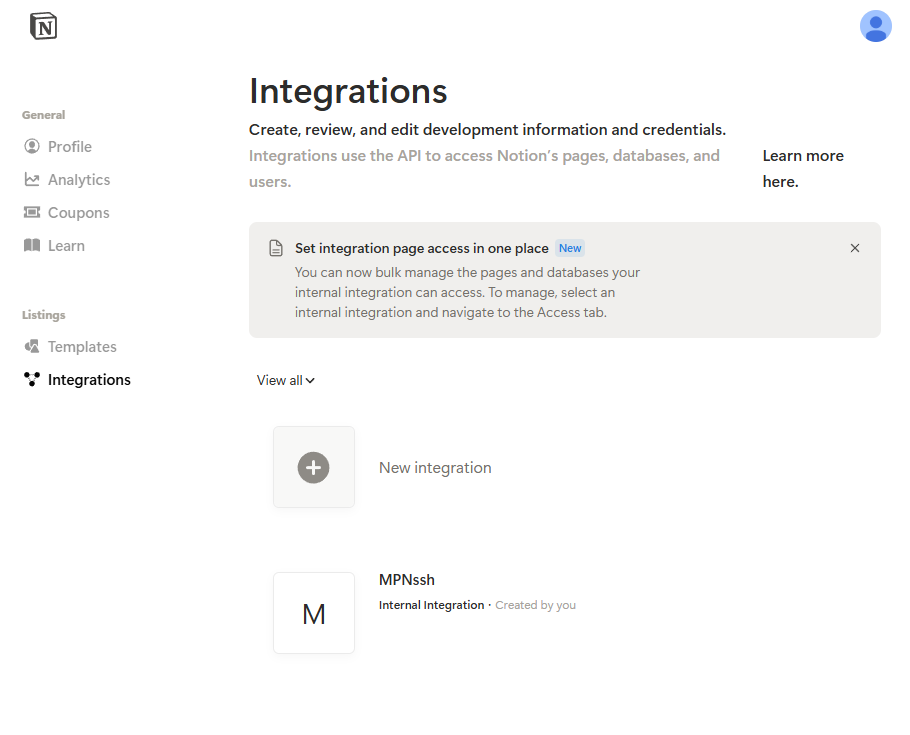
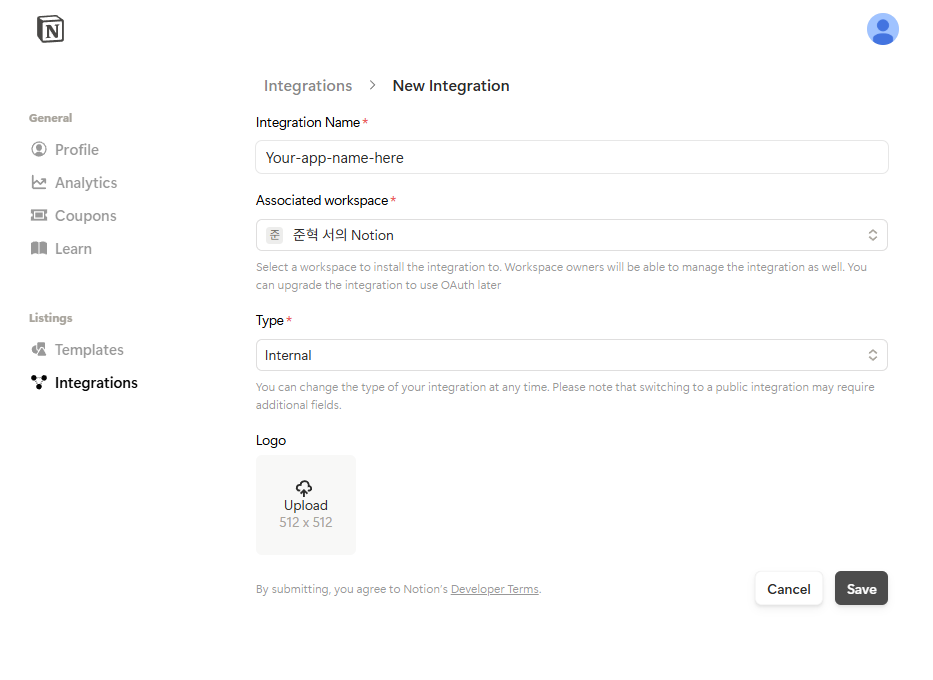

# NotionSSH

## Language / 언어
- [🇰🇷 한국어](README.md)
- [🇺🇸 English](README_en.md)

---

A remote command execution tool that integrates with Notion pages. Execute shell commands on remote servers by writing commands in a Notion page and view results in real-time without VPN connections.

**Execute SSH-like commands anywhere, anytime using Notion - no VPN required!**  
Built with Rust for reliability and performance.

*[TMI]: Actually checks every 1 second :)*

## Overview

NotionSSH monitors designated Notion pages for command blocks and executes them on the host machine. Write commands using the special syntax `!(command)` in paragraph or to-do blocks, and execution results are automatically appended to the page with timestamps, user information, and machine details in code blocks.

## Key Features

- **Remote Command Execution**: Execute shell commands on any machine running NotionSSH
- **Cross-Platform Support**: Works on Windows, Linux, and macOS  
- **Real-time Results**: Command outputs appear automatically in your Notion page
- **User Tracking**: Logs who executed which commands with timestamps
- **Audit Logging**: Maintains local command and audit logs for security
- **Duplicate Prevention**: Prevents re-execution of already processed commands
- **CA Certificate Verification**: Verifies that the communicating server is genuinely Notion's server - see [ca_en.md](./docs/ca_en.md)

## Installation

### Prerequisites

- Rust 1.70 or later
- A Notion integration with API access
- A Notion page where you want to execute commands

### Building from Source

```bash
git clone https://github.com/mirseo/notionSSH
cd notionSSH
cargo build --release
```

The executable will be available at `target/release/notionSSH` (or `notionSSH.exe` on Windows).

Or you can run directly with Cargo:
```bash
git clone https://github.com/mirseo/notionSSH
cd notionSSH
cargo run
```

## Configuration

NotionSSH requires two configuration parameters:

1. **Notion API Key**: Your Notion integration token
2. **Notion Page URL**: The URL of the page where commands will be monitored
   - Please include http/https in the URL

### Configuration Methods

#### Method 1: Environment Variables
```bash
export NOTION_API_KEY="secret_xxxxxxxxxxxxx"
export NOTION_PAGE_URL="https://www.notion.so/your-page-id"
```

#### Method 2: Interactive Setup
Run the program without environment variables, and it will prompt you for the required information:
```bash
./notionSSH
```

Configuration will be saved to `.notionSSH/storage.json` for future use.
- To reset configuration, delete the `.notionSSH` folder
- This program collects no data and only makes requests to Notion's official API

### Setting up Notion Integration

Follow these steps to create and configure your Notion integration:

#### Step 1: Access Notion Integrations
1. Go to https://www.notion.so/my-integrations
2. Navigate to the "Integrations" section in your settings



#### Step 2: Create New Integration
1. Click the "+ New integration" button
2. Fill in the integration details:
   - **Integration Name**: Enter a name for your integration (e.g., "NotionSSH")
   - **Associated workspace**: Select your workspace (default recommended)
   - **Type**: Keep it as "Internal" (recommended for security)
3. Click "Save" to create the integration



#### Step 3: Get Your API Key
1. After creating the integration, you'll see the configuration page
2. Copy the "Internal Integration Secret" - this is your API key (keep it secure!)
3. Save this key temporarily as you'll need it for configuration


#### Step 4: Configure Page Access
1. Go to the "Access" tab in your integration settings
2. Click "Select pages" to choose which pages the integration can access


#### Step 5: Select Target Pages
1. In the page selection dialog, choose the pages where you want to run commands
2. You can select specific pages or entire sections (selecting only necessary pages is recommended)
3. Click "Update access" to save your selection


#### Step 6: Get Page URL
1. Navigate to the Notion page you selected for command execution
2. Copy the URL from your browser's address bar
3. This URL will be used in the NotionSSH configuration

## Usage

### Running the Application

```bash
./notionSSH
```

The application will start monitoring your Notion page and display:
```
[*] NotionSSH is Loading - waiting for commands. Press Ctrl+C to stop.
```

### Writing Commands

Write commands in your Notion page using the following syntax:

#### Basic Command Syntax
Commands must be enclosed in `!()` parentheses:

```
!(ls -la)
!(docker ps)
!(systemctl status nginx)
```

#### Supported Block Types
Commands can be written in either:
- **Regular paragraph blocks**: Just type the command with `!()` syntax
- **To-do list items**: Add commands as checklist items for better organization

#### Example Commands
Supports all console commands and triggers available on your system:

**System Information:**
```
!(uname -a)
!(df -h)
!(ps aux)
```

**Docker Management:**
```
!(docker ps)
!(docker images)
!(docker logs container-name)
```

**File Operations:**
```
!(ls -la /var/log)
!(tail -n 50 /var/log/syslog)
!(find /home -name "*.txt")
```

### Command Results

When a command is executed, NotionSSH automatically appends a code block containing:

```
$ your-command
[command output here]
---
executed_by=user@example.com | node=hostname | 2025-09-11T10:30:45Z
# notionSSH-executed
```

Followed by a metadata paragraph showing:
- **User email**: Who executed the command
- **Machine name**: Which server ran the command  
- **Timestamp**: When the command was executed
- **Execution marker**: Prevents re-execution of the same command

## Logging

NotionSSH maintains two types of logs:

### Command Logs
- Location: `./logs/command.YYYYMMDD.log`
- Format: `[YYYY-MM-DD:HH:MM:NNNNN] {user@email.com} : command`
- Contains timestamped record of all executed commands

### Audit Logs
- Location: `./log` (single file)
- Format: `command , requester , iso_timestamp , node_name , status`
- CSV-format audit trail for compliance and security monitoring

## Security Considerations

- **Access Control**: Only users with edit access to the Notion page can execute commands
- **Command Logging**: All commands are logged with user attribution
- **No Authentication**: The tool trusts Notion's user management
- **Shell Access**: Commands run with the same privileges as the NotionSSH process
- **User Access Control**: Supports fine-grained permission management - see [access_en.md](./docs/access_en.md)

## Architecture

### Core Components

- **config.rs**: Handles configuration loading and validation
- **notion.rs**: Notion API client and page interaction
- **parser.rs**: Command parsing from Notion blocks
- **executor.rs**: Cross-platform command execution
- **logger.rs**: Audit and command logging
- **util.rs**: Utility functions for URL parsing and system info
- **verify.rs**: CA certificate parsing and authentication functions for security
- **access.rs**: Security functions that support account-based permission settings

### Command Processing Flow

1. Monitor Notion page for new blocks containing `!(command)` pattern
2. Parse commands and check for existing execution markers
3. Execute commands using platform-appropriate shell
4. Capture output and execution metadata
5. Append results to Notion page
6. Log command execution for audit purposes

## Platform Support

### Windows
- Uses `cmd /C` for command execution
- Reads `COMPUTERNAME` environment variable for node identification

### Linux/Unix/macOS
- Attempts execution with `$SHELL`, `bash`, then `sh`
- Uses `hostname` command for node identification
- Supports `HOSTNAME` environment variable

## Development

### Running Tests
```bash
cargo test
```

### Building for Release
```bash
cargo build --release
```

### Code Structure
- `src/lib.rs`: Main application loop and orchestration
- `src/main.rs`: Entry point
- Individual modules handle specific responsibilities (config, notion API, parsing, etc.)

## Troubleshooting

### Common Issues

**"Failed to fetch children" errors**
- Verify your Notion API key is correct
- Ensure the integration has access to the target page
- Check that the page URL is valid

**Commands not executing**
- Verify command syntax uses `!(command)` format
- Check that commands haven't already been executed (look for execution markers)
- Ensure NotionSSH has appropriate system permissions

**Permission denied errors**
- Run NotionSSH with appropriate privileges for the commands you want to execute
- Check file/directory permissions for log output

## Contributing

This project is written in Rust and follows standard Rust development practices. Contributions should include tests and maintain the existing code style.

## License

This project follows the MIT License.  
Free modification, redistribution, and derivative works are permitted under the full scope of the license.